# BillBandit Screen Network

Generated from the BillBandit QA iOS simulator on 2026-06-21.

## Visuals

- [V4 Railway iOS workflow route-strip map](billbandit-route-strips-v4-railway.png) recommended for the current iOS-only Railway-tested scope
- [V4 Railway route manifest](billbandit-v4-railway-route-manifest.json)
- [V3 route-strip navigation map](billbandit-route-strips-v3.png) recommended
- [V3 route manifest](billbandit-v3-route-manifest.json)
- [Clean route-strip navigation map v2](billbandit-route-strips-v2.png)
- [Clean route-strip navigation map v1](billbandit-route-strips.png)
- [Storyboard route map](billbandit-storyboard-route-map.png)
- [Connected navigation network](billbandit-navigation-network.png)
- [Screen contact sheet](billbandit-screen-contact-sheet.png)
- [Raw screenshots](screens/)

## Capture Notes

- V4 was regenerated after the Railway-only iOS test pass. It updates the workflow network for OTP/profile/logout, Railway ledger create/add/edit/delete/finalize, add-friend-by-email, two-person split, settlement row, and record payment.
- V4 intentionally excludes the web UI and native tab UI because the current workstream is scoped to the blue/cream iOS ink app.
- `17-profile-placeholder` is a placeholder for the newly wired Profile screen until the next simulator screenshot capture.
- Screens 01-15 were captured from the installed simulator app using the app's launch arguments.
- `05a-date-picker` and `06a-ledger-empty` were captured by driving the simulator UI with XcodeBuildMCP.
- `06b-finalized-ledger` was captured after marking the demo ledger final and tapping See all.
- `16-account-friends-placeholder` is a placeholder surface for the app-level friend loop, because that screen has not been captured as a real app screen yet.
- Screens are clean app screenshots, without browser annotation overlays.

## Navigation Graph

```mermaid
flowchart LR
  welcome["01 Welcome"]
  authStart["12 Auth Start"]
  authOtp["13 Auth OTP"]
  authProfile["14 Auth Profile"]
  authLoading["15 Auth Loading"]
  tripsEmpty["03 Trips Empty"]
  yourTrips["04 Your Trips"]
  newLedger["05 New Ledger"]
  datePicker["05a Date Picker"]
  ledgerEmpty["06a Ledger Empty"]
  liveLedger["06 Live Ledger"]
  finalizedLedger["06b Finalized Ledger"]
  addEntry["10 Add Entry"]
  addFriend["11 Add Friend"]
  accountFriends["16 Account/Friends Placeholder"]
  settle["07 Settle"]
  recordPayment["08 Record Payment"]
  finalBill["09 Final Bill"]

  welcome -->|"Returning login"| authStart
  authStart -->|"Send code"| authOtp
  authOtp -->|"Verify"| authLoading
  authLoading -->|"Existing ledgers"| yourTrips
  authLoading -. "No ledgers" .-> tripsEmpty

  welcome -->|"Create account"| authStart
  authOtp -->|"New user profile"| authProfile
  authProfile --> authLoading
  tripsEmpty -->|"Start a trip"| newLedger
  yourTrips -->|"Open"| liveLedger

  newLedger -->|"Dates"| datePicker
  newLedger -->|"Open ledger"| ledgerEmpty
  ledgerEmpty -->|"Add entry"| addEntry
  addEntry --> liveLedger

  liveLedger -->|"Add entry; ledger updates"| addEntry
  liveLedger -->|"Add a friend to this ledger"| addFriend
  addFriend --> liveLedger
  accountFriends -->|"Add app friend"| addFriend
  addFriend --> accountFriends
  liveLedger -->|"Mark final"| finalBill
  finalBill -->|"See all"| finalizedLedger
  finalizedLedger -->|"Settle tab"| settle
  settle -->|"Tap owed line"| recordPayment
  recordPayment -->|"Mark paid; row disappears"| finalBill
  finalBill --> finalizedLedger
```

## Screens

| Screen | File |
| --- | --- |
| 01 Welcome | [screens/01-welcome.png](screens/01-welcome.png) |
| 02 New Member | [screens/02-new-member.png](screens/02-new-member.png) |
| 03 Trips Empty | [screens/03-trips-empty.png](screens/03-trips-empty.png) |
| 04 Your Trips | [screens/04-your-trips.png](screens/04-your-trips.png) |
| 05 New Ledger | [screens/05-new-ledger.png](screens/05-new-ledger.png) |
| 05a Date Picker | [screens/05a-date-picker.png](screens/05a-date-picker.png) |
| 06 Live Ledger | [screens/06-live-ledger.png](screens/06-live-ledger.png) |
| 06a Ledger Empty | [screens/06a-ledger-empty.png](screens/06a-ledger-empty.png) |
| 06b Finalized Ledger | [screens/06b-finalized-ledger.png](screens/06b-finalized-ledger.png) |
| 07 Settle | [screens/07-settle.png](screens/07-settle.png) |
| 08 Record Payment | [screens/08-record-payment.png](screens/08-record-payment.png) |
| 09 Final Bill | [screens/09-final-bill.png](screens/09-final-bill.png) |
| 10 Add Entry | [screens/10-add-entry.png](screens/10-add-entry.png) |
| 11 Add Friend | [screens/11-add-friend.png](screens/11-add-friend.png) |
| 12 Auth Start | [screens/12-auth-start.png](screens/12-auth-start.png) |
| 13 Auth OTP | [screens/13-auth-otp.png](screens/13-auth-otp.png) |
| 14 Auth Profile | [screens/14-auth-profile.png](screens/14-auth-profile.png) |
| 15 Auth Loading | [screens/15-auth-loading.png](screens/15-auth-loading.png) |
| 16 Account/Friends Placeholder | [screens/16-account-friends-placeholder.png](screens/16-account-friends-placeholder.png) |
